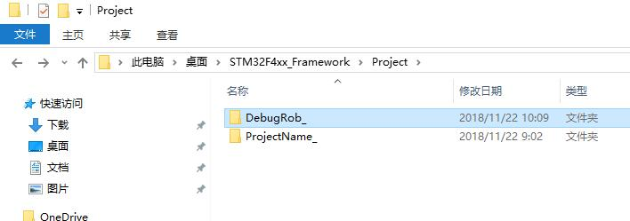
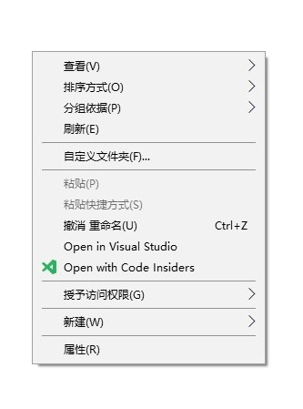
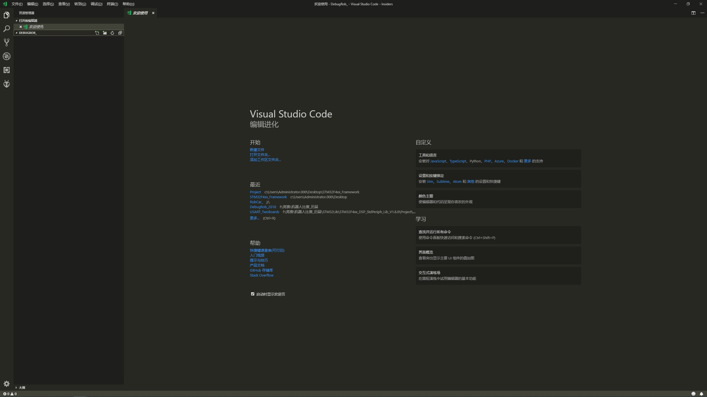
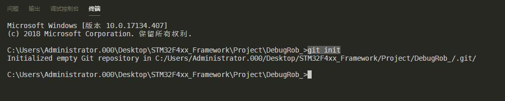

# Git与远程Git仓库
这篇文章将从Git本地仓库的创建，到最终可以顺利完成文档编辑的团队协作而介绍。

## 目录
* [工程目录与本地Git初始化](#工程目录)
* [个人使用的远程Github仓库](#个人使用的远程Github仓库)
* [个人使用的本地Git仓库](#个人使用的本地Git仓库)
* [团队使用的远程Git仓库](#团队使用的远程Git仓库)

## 工程目录与本地Git初始化
``` 
我们的工程目录如下所示：
STM32F4xx_Framework
  |- Libraries // 库函数
  |- Project   // 项目主目录
      |- ProjectName_ // 我们的工程名称
          |- .git       // 本地git库文件
          |- _Layer     // 抽象层，放代码模块的地方
          |- MDK-ARM    // Keil-MDK启动器文件
          |- README_doc // 工程文档
          |- README_img // 工程文档引用图片
          |- main.c     
          |- main.h
          |- README.MD  // 主MarkDown
          |- stm32f4xx_conf.h 
          |- stm32f4xx_it.c
          |- stm32f4xx_it.h
          |- system_stm32f4xx.c
  |- Utilities //工具
```
我们的工程文件从 STM32F4xx 框架中来，并将 git 建立在 ProjectName_ 目录内，也就是我们真正使用的这个工程主文件目录中。在准备好一个 STM32F4 框架文件后，就可以按照下面的步骤开始搭建本地 git 环境了。

### 1、创建新建文件夹
在项目目录中新建一个文件夹如下图所示：

<div align=center></div>

进入该文件目录下。

### 2、初始化Git仓库
这个部分有许多方式，这里介绍一种在 VSCode 下初始化的流程。首先用 VSCode 打开这个文件夹，可以通过 _右键，使用VisualStuido Code打开_ 的方式，

<div align=center></div>

也可以使用在 PowerShell 中，输入 
``` bash
code [Dir]
```
打开后效果如下图

<div align=center></div>

在 VSCode 中呼出 Terminal 终端，可以用 [Ctrl + ~] 的方式快速呼出。在终端中输入 
``` bash
git init
```
效果如下
<div align=center></div>

这个时候，你可以在原来那个文件夹下看到一个隐藏目录 .git，如果没有这个目录，很可能上面的某些过程错了。

## 个人使用的远程Github仓库

## 个人使用的本地Git仓库

## 团队使用的远程Git仓库
